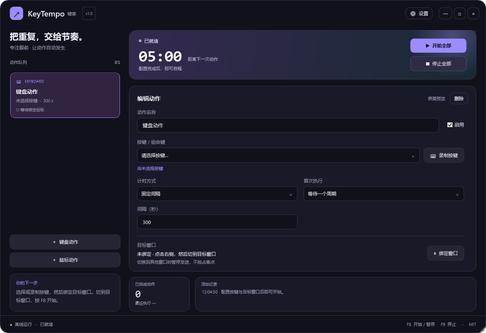

# KeyTempo · 键奏

**让重复操作，按你的节奏运行。**

Keyboard & mouse automation, at your own tempo.

Windows 10 / 11 x64 · 简体中文 / English · .NET 8 WPF · MIT

适用于 Windows 10 / 11（64 位）的自动按键与鼠标点击工具。每个动作独立计时，用一个控制台配置键盘组合键、多个鼠标位置和运行反馈。采用 .NET 8 WPF，支持便携单文件和当前用户安装版。



## 下载即用

[**下载 KeyTempo.exe — Windows 64 位**](https://github.com/Yunis3056/KeyTempo/releases/latest/download/KeyTempo.exe) · [所有版本和安装包](https://github.com/Yunis3056/KeyTempo/releases) · [项目源码](https://github.com/Yunis3056/KeyTempo)

下载 `KeyTempo.exe`，双击即可运行。程序自包含运行环境，**无需安装 .NET，也无需联网启动**。首次启动时按键为空，由你选择实际需要发送的键。

| 文件 | 适用场景 |
| --- | --- |
| `KeyTempo.exe` | 直接下载、直接运行 |
| `KeyTempo-1.0.0-win-x64-portable.zip` | 程序、使用指南与许可证，适合完整保存 |
| `KeyTempo-1.0.0-win-x64-setup.exe` | 安装到当前用户目录，创建快捷方式并支持卸载 |
| `KeyTempo-1.0.0-source.zip` | 源码、测试和构建说明 |
| `SHA256SUMS.txt` | 核对下载文件的 SHA-256 校验值 |

## 快速开始

1. 运行 `KeyTempo.exe`。便携版已经包含 .NET 运行时，无需另外安装 SDK。
2. 新建或选择键盘动作，然后选择或录制你要发送的按键。**程序不预设任何按键**。
3. 间隔默认是 `300` 秒，即 5 分钟。选择首次等待或立即执行。
4. 记录目标窗口，切回该窗口，然后按 `F8` 开始。`F8` 再次按下暂停 / 继续，`F9` 停止。

例如需要每 5 分钟按一次某个键时，只配置一个键盘动作，自己录入目标按键，保留 300 秒的固定间隔即可。详细操作见 [使用指南](docs/USER_GUIDE.md)。

## 功能

- 多个键盘 / 鼠标动作，每个动作拥有自己的间隔与启用状态。
- 单键与组合键选择、按键录制；左 / 右键单击与双击，多位置按顺序执行。
- 固定间隔、随机最小 / 最大间隔、中心间隔加随机幅度；选择立即首次执行或先等待。
- 全局快捷键记录鼠标位置；支持屏幕绝对坐标和目标窗口相对坐标。
- 绑定目标窗口、前台窗口核对、异常暂停 / 跳过策略；暂停与停止分别处理。
- 倒计时、执行次数、最近 / 下次执行时间、日志、声音和托盘反馈。
- 深浅主题、强调色、透明度及动效档位；简体中文 / English。
- 最小化到托盘、全局快捷键设置、配置自动保存与导入 / 导出、单实例运行。
- 默认离线，没有遥测。只有手动点击“检查更新”才访问用户配置的 GitHub 仓库。

## 运行边界

输入发往实际的前台窗口。绑定窗口用于核对目标，**不会向后台窗口强制发送输入，也不会抢夺前台焦点**。切到其他软件时，按对应异常策略暂停或跳过；需要重新切回目标再继续。目标关闭后应重新绑定。

程序默认使用普通权限；Windows 可能阻止普通权限程序向管理员权限应用注入输入。某些游戏、远程桌面及受保护应用也可能不接受模拟输入。鼠标位置基于实际桌面坐标；目标窗口相对坐标会随窗口位置移动，但按钮布局变化后需要重新记录。机器休眠、锁屏期间不执行输入，恢复后不补发漏掉的周期。

## 构建与发布

开发需要 Windows 与 [.NET 8 SDK](https://dotnet.microsoft.com/download/dotnet/8.0)。

```powershell
dotnet run --project .\AutoPilotInput\AutoPilotInput.csproj
powershell -NoProfile -ExecutionPolicy Bypass -File .\scripts\publish.ps1
```

产物位于 `artifacts/keytempo-release/`：可直接下载的 EXE、便携 ZIP、源码 ZIP 和校验值，以及在本机存在 Inno Setup 6 时生成的安装包。自包含的单文件会比普通小工具更大，因为它包含 .NET 运行时；初次启动可能需要解压本机运行库。

更多命令、安装包构建和 GitHub 标签发布说明见 [构建指南](BUILD.md)。开源协作见 [贡献指南](CONTRIBUTING.md)、[行为准则](CODE_OF_CONDUCT.md) 与 [领域词汇](CONTEXT.md)。

官方仓库为 [Yunis3056/KeyTempo](https://github.com/Yunis3056/KeyTempo)。程序内“检查更新”默认使用此仓库，只有用户主动点击时才联网。

## English quick start

**KeyTempo** is an offline Windows keyboard and mouse automation tool with independent timers, global hotkeys, a system tray, and a customizable WPF dashboard.

Download `KeyTempo.exe` from GitHub Releases and run it. The executable includes the .NET runtime. No key is selected on first launch: choose or record a key, set an interval (300 seconds by default), and bind your target window. Keep that window in the foreground; press `F8` to start / pause / resume and `F9` to stop. Mouse actions support ordered positions, clicks, and window-relative coordinates.

KeyTempo does not collect telemetry or connect on startup. Only the manual **Check for updates** action accesses the configured GitHub repository. See [BUILD.md](BUILD.md) for build and release commands.

## 许可证

项目源代码采用 [MIT License](LICENSE)。打包包含的第三方运行时采用各自许可证，见 [第三方声明](THIRD_PARTY_NOTICES.md)。
